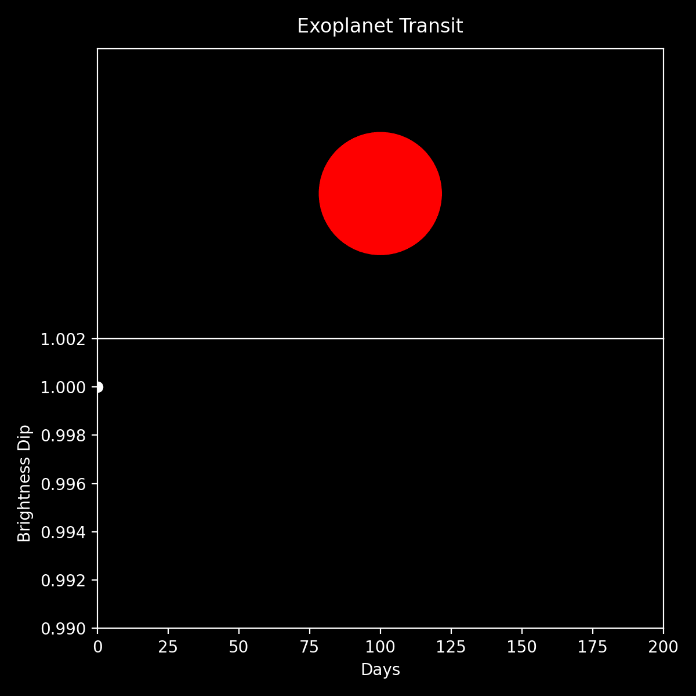

# PyTransit

This is a simple educational demo for exoplanet transits. I include both an interactive jupyter notebook and a python script for running the code. 

To use this code first clone the repository. After the repository is on your local machine, you can either open the jupyter notebook located in the `notebooks` directory or run the python script in the `scripts` folder. All outputs will be saved to the `outputs` directory.

### Script Use

To use the python script, run the following code in your terminal

```
python run_transit.py
```
We include optional parameters to change the output animation. The optional arguments are

* `num_frames` - [Int] - This number tells the script how many frames you want in your animation. Default is 200.
* `planet_radius` - [Float] - The radius of your planet. Default value is 0.3
* `star_radius` - [Float] - The radius of your star. Default value is 5.0
* `camera_distance` - [Float] - The distance the camera is away from the system. Default value is 8.0

including the parameters in your command line would look like

```
python run_transit.py -num_frames 200 -planet_radius 0.3 -star_radius 5.0 -camera_distance 8.0
```

### Output

A typical output of this code looks like

<p align="center">
    
</p>
